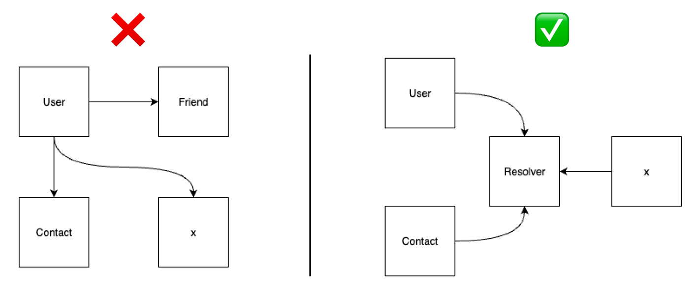

# Ghost


<p style="text-align: center;">


</p>

Ghost is a minimalist Ruby DSL defining ghost associations in Rails — no ORM, just plain Ruby objects.

⚠️ **Note: This project is still under active development.**  
Features, interfaces, and behavior may change in future versions.

## Installation
Add this line to your application's Gemfile:
```ruby
gem "niaga-ghost"
```
And then execute:
```ruby
$ bundle
```
Or install it yourself as:
```ruby
$ gem install niaga-ghost
```

## Usage

### Resolver
In Ghost, a Resolver is a lightweight Ruby object designed to fetch or construct related data between entities—such as User, Contact, or x—while ensuring that these entities remain loosely coupled.




### Example
```ruby
./bin/rails generate niaga_ghost Contact
  # create  app/models/resolvers/contact_resolver.rb
  # create  app/models/contact.rb
```

```ruby
# models/user.rb
class User < ApplicationRecord
  has_delegate :contacts
  # or
  # has_delegate :contacts, resolver: "ContactResolver"

  # ...
end


# models/resolvers/contact_resolver.rb
class ContactResolver
  def call(base)
    generate
  end

  def generate
    collection = []

    10.times do |i|
      collection << Contact.new(i, Faker::Name.name, Faker::PhoneNumber.cell_phone)
    end

    collection
  end
end


# models/contact.rb
class Contact
  attr_accesor :id, :name, :phone_number

  def initialize(id, name, phone_numer)
    @id = id
    @name = name
    @phone_number = phone_number
  end
end
```

```ruby
  # irb
  >> user = User.first
    # #<User:0x0000000126c229b0...
  >> user.contacts
    # [#<Contact:0x0000000126c211b0, ..., ...]
```


## Contributing
1. Fork it
2. Create your feature branch (git checkout -b my-new-feature)
3. Commit your changes (git commit -am 'Added some feature')
4. Push to the branch (git push origin my-new-feature)
5. Create new Pull Request

## License

The gem is available as open source under the terms of the [MIT License](https://opensource.org/licenses/MIT).